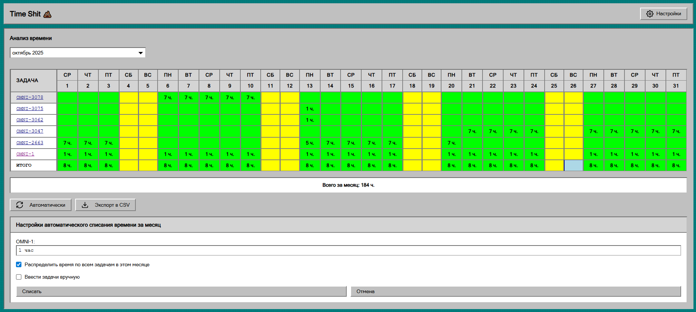

# Time Shit 💩

Редактор рабочих журналов для Jira.



## Описание

Time Shit — это браузерное расширение для Chrome, которое позволяет легко управлять и редактировать рабочие журналы (worklogs) в Jira. Расширение предоставляет удобный интерфейс для просмотра, редактирования и автоматического заполнения времени по задачам.

## Функциональность

### Основные возможности

- **Просмотр рабочих журналов** — отображение всех worklogs за выбранный месяц (до 12 месяцев назад)
- **Визуализация времени** — календарное представление с цветовой индикацией:
  - Выходные дни
  - Дни с превышением нормы часов
  - Текущий день
- **Редактирование worklogs** — создание, обновление и удаление записей времени через интуитивный интерфейс
- **Автоматическое заполнение времени** — функция для массового списания времени за месяц:
  - Установка фиксированного времени для задачи OMNI-1
  - Распределение оставшегося времени по всем задачам месяца или выбранным задачам
- **Экспорт данных** — выгрузка данных в CSV формат
- **Фильтрация задач** — настройка списка задач для отображения

### Настройки

- URL Jira сервера
- Логин пользователя (name)
- Фильтр задач (список ключей задач через запятую)
- Норма часов в день

## Установка

1. Клонируйте репозиторий:
   ```bash
   git clone <repository-url>
   cd time-shit
   ```

2. Откройте Chrome и перейдите по адресу `chrome://extensions/`

3. Включите режим разработчика (Developer mode) в правом верхнем углу

4. Нажмите "Загрузить распакованное расширение" (Load unpacked)

5. Выберите папку с проектом

## Использование

### Первоначальная настройка

1. Откройте расширение (клик по иконке расширения в панели инструментов)
2. Нажмите на кнопку "Настройки" в правом верхнем углу
3. Заполните обязательные поля:
   - **Jira URL** — адрес вашего Jira сервера (например, `https://your-company.atlassian.net`)
   - **Логин (name)** — ваш username в Jira
   - **Фильтр задач** — список ключей задач через запятую (например, `PROJ-123, PROJ-456`)
   - **Норма часов в день** — стандартное количество рабочих часов (по умолчанию 8)
4. Сохраните настройки

**Важно:** Для работы расширения необходимо быть авторизованным в Jira в текущей сессии браузера. Если вы видите сообщение об ошибке авторизации, откройте Jira в новой вкладке, авторизуйтесь, затем обновите страницу расширения.

### Работа с рабочими журналами

1. Выберите месяц из выпадающего списка (доступны последние 12 месяцев)
2. Дождитесь загрузки данных (отображается прогресс-бар)
3. Просмотрите таблицу с задачами и днями месяца
4. Кликните по ячейке с днём для редактирования времени:
   - Введите количество часов
   - Выберите дни для применения (можно выбрать несколько)
   - Подтвердите изменения

### Автоматическое заполнение времени

1. Нажмите кнопку "Автоматически"
2. Укажите количество часов для задачи OMNI-1
3. Выберите режим распределения:
   - **Распределить время по всем задачам в этом месяце** — время будет распределено по всем задачам, кроме OMNI-1
   - **Ввести задачи вручную** — укажите список задач через запятую
4. Нажмите "Списать"
5. Подтвердите операцию

Расширение автоматически:
- Найдёт дни, в которых не хватает часов до нормы
- Установит указанное время для OMNI-1 в эти дни
- Распределит оставшееся время до нормы по выбранным задачам

### Экспорт данных

Нажмите кнопку "Экспорт в CSV" для сохранения текущих данных в CSV файл.

## Технические детали

- **Manifest Version:** 3
- **API:** Jira REST API v2
- **Хранение данных:** Chrome Storage API (sync)
- **Аутентификация:** Использует cookies текущей сессии браузера

## Требования

- Google Chrome (или другой Chromium-браузер)
- Аккаунт в Jira с правами на просмотр и редактирование worklogs
- Авторизация в Jira в текущей сессии браузера

## Лицензия

Этот проект лицензирован под MIT License. Подробности смотрите в файле [LICENSE](LICENSE).
